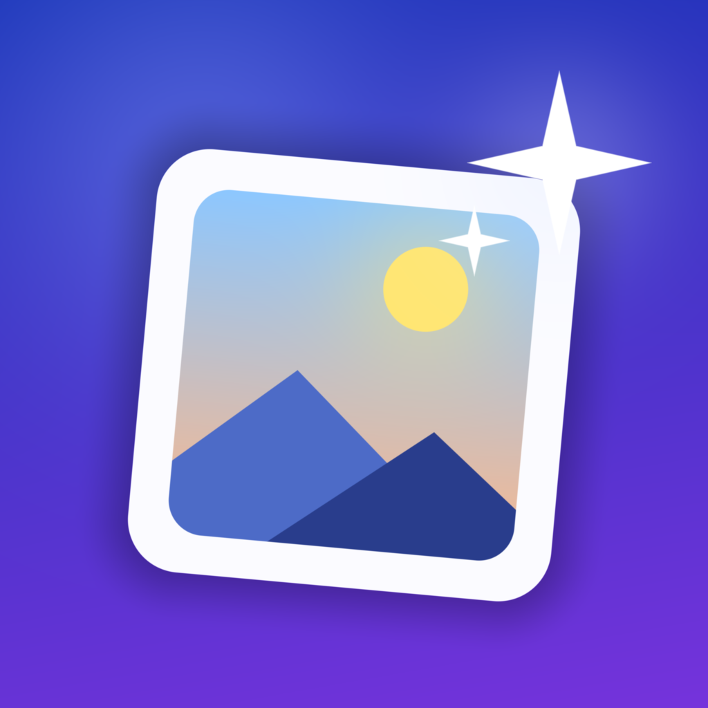

# PicShop

**Voice-first, on-device photo & video editing for iPhone 17 Pro.**
Say *« efface le chien à gauche »* or *"make it warmer and crop for Instagram"* — PicShop
understands French and English, plans the edit with an on-device language model, finds the
pixels with Apple Vision, and renders the result with Core Image and Metal. Nothing leaves the phone.

<p align="center">
  
</p>

## What it does

| Photo | Video |
|---|---|
| Object removal by voice, tap or brush (PatchMatch built in, LaMa optional) | Object removal across a clip (Vision tracking + per-frame inpainting) |
| Background removal, replacement (colour/gradient), portrait blur | Split, trim, delete ranges, reorder, duplicate, freeze frame, extract frame |
| 19 non-destructive adjustments, 20 looks, tone curves, selective edits | Speed (slow-mo / time-lapse), reverse, stabilisation |
| Crop/aspect presets, rotate, straighten (auto horizon), flip, perspective | Per-clip looks & adjustments, A/B-roll transitions (dissolve, fade, slide, wipe, zoom, blur) |
| Text & shape layers, blend modes, opacity, masks | Text overlays with fades, music with ducking and fades, per-clip audio |
| Upscale (Lanczos, Real-ESRGAN optional), denoise, relight | Aspect presets (9:16, 1:1, 16:9 …), HEVC export |
| **Precise**: magic wand, lasso, pixel brush, clone stamp, pixel grid loupe | |
| **Generative fill**: "remplace le ciel par un coucher de soleil", recolor "make the car red" | |

| PDF |
|---|
| Reorder, rotate, delete, duplicate, insert blank pages, merge documents, page numbers |
| Draw, highlight / underline / strike / redact by voice (« surligne « total » partout »), text, photos, signature |
| Search, extract a page as a photo (then edit it), export a standard PDF with real annotations |

Everything is undoable, saved as a project package, and exportable to Photos.

## The voice pipeline

```
mic ─▶ SpeechAnalyzer (iOS 26, on-device) ─▶ transcript
      ─▶ RuleBasedIntentEngine  (FR/EN grammar, <1 ms, always on)
      ─▶ Apple Foundation Model / Pro Brain (MLX Qwen3 4B)  for ambiguous requests, 6 s budget
      ─▶ EditPlan (typed intents) ─▶ PhotoCommandExecutor / VideoCommandExecutor
      ─▶ Vision grounding (instance masks · people · animals · text · embeddings)
      ─▶ CandidateSelector ("the one on the left", "the second", "all", or asks which)
      ─▶ EditOperation on the document ─▶ Core Image render ─▶ Metal canvas
```

Three "brains" are available in Settings, all on device:

1. **Instant** — a deterministic grammar covering hundreds of phrasings in French and English. It always runs first.
2. **Apple Intelligence** — the system foundation model with guided generation (`@Generable`), constrained to the app's action schema.
3. **Pro Brain** — Qwen3 4B (4-bit) through MLX for long, multi-step requests. Optional download.

Model output is validated against the app vocabulary before execution; hallucinated actions or values are dropped.

## Requirements

- Xcode 26, iOS 26 SDK. Runs on iPhone 15 Pro and later; tuned for iPhone 17 Pro.
- [XcodeGen](https://github.com/yonaskolb/XcodeGen) to generate the project.

```bash
brew install xcodegen
Scripts/bootstrap.sh          # generates Picshop.xcodeproj
open Picshop.xcodeproj        # set your team, run on device
```

The platform-independent engine (documents, timeline, intent parsing, PatchMatch) builds and tests anywhere Swift runs:

```bash
swift test                    # 77 tests, ~1 s
```

## Project layout

```
App/                 iOS app target (entry point, Info.plist, assets, optional MLX engine)
Sources/PicshopCore      documents · layers · edit stack · undo history · timeline · intents · project store
Sources/PicshopIntent    FR/EN grammar · LLM schema & normaliser · Foundation Models engine · router · executors
Sources/PicshopImaging   Core Image graph · Vision grounding · masks · PatchMatch & Core ML inpainting · export
Sources/PicshopVideo     AVComposition builder · custom compositor · transcoder · AI video services · export
Sources/PicshopSpeech    SpeechAnalyzer / SFSpeechRecognizer voice controller · spoken replies
Sources/PicshopUI        Liquid Glass design system · library · photo & video editors · voice orb · settings
Tests/                   XCTest suites (core, intent, imaging)
Scripts/                 bootstrap, string catalogue, icon, model conversion & packaging, syntax gate
docs/                    ARCHITECTURE · VOICE_COMMANDS · MODELS
```

## Documentation

- [docs/ARCHITECTURE.md](docs/ARCHITECTURE.md) — modules, data flow, rendering and concurrency model
- [docs/VOICE_COMMANDS.md](docs/VOICE_COMMANDS.md) — what you can say (FR/EN)
- [docs/MODELS.md](docs/MODELS.md) — optional neural models (LaMa, Real-ESRGAN, Qwen3) and how to host them

## Privacy

No servers, no accounts, no analytics. Speech recognition, language models, segmentation and rendering
run on the device. The privacy manifest (`App/PrivacyInfo.xcprivacy`) declares no tracking and no data collection.

## License

MIT — see [LICENSE](LICENSE).
